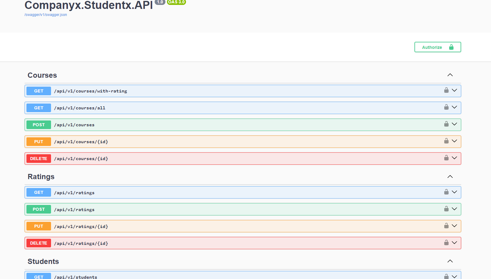

# Project studentx

# Prerequirements
* .NET Core SDK 8.0
* Postgresql

# How To Run

1 - Create database on postgresql

2 - create file appsettings.development or put file appsettings

```json
{
  "Logging": {
    "LogLevel": {
      "Default": "Information",
      "Microsoft.AspNetCore": "Warning"
    }
  },

  "ConnectionStrings": {
    "DatabasePostgreSql": "Host=localhost;Port=5433;Pooling=true;Database=studentxdb;User Id=postgres;Password=postgres;" // you case you need set your connection string
  },


  "JwtBearerSettings": {
    "Secret": "80f46d8ee501457293ad589240f117b0",
    "ExpirationInHours": "1",
    "Issuer": "Identity",
    "Audience": "https://localhost/"
  }

}

```

3 -  (opcional) - if you add fake data, you need first run application after uncoment lin  app.SeedFakeData() on file program.cse and run again;

4 - after run poject open your browser with url https://localhost:7052/swagger/index.html or http://localhost:5068




## Technologies implemented:

- ASP.NET 8.0
 - ASP.NET MVC Core 
 - ASP.NET WebApi Core with JWT Bearer Authentication
 - ASP.NET Identity Core
- Entity Framework Core 8.0
- DI scanner with Nuget package [ShortCleanExtension](https://github.com/salesHgabriel/ShortCleanLinqExtensions)
- FluentValidator
- MediatR
- Swagger UI with JWT support
-  PostgreSql

## Architecture:

- Full architecture with responsibility separation concerns, SOLID and Clean Code
- Domain Driven Design (Layers and Domain Model Pattern)
- Domain Events
- Domain Notification
- Domain Validations
- Rich Domain
- CQRS (Imediate Consistency)
- Unit of Work
- Repository